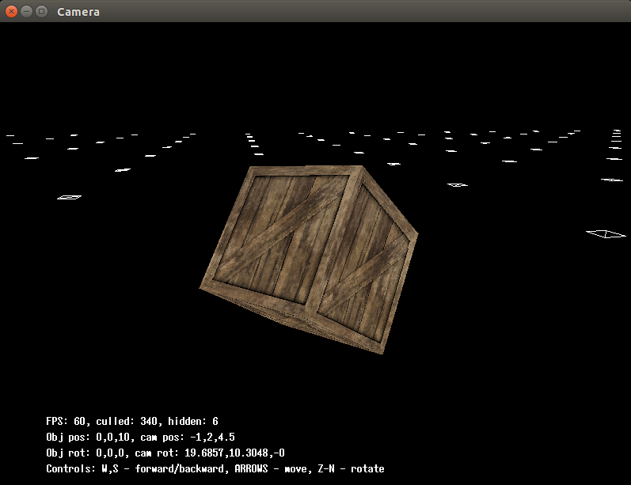
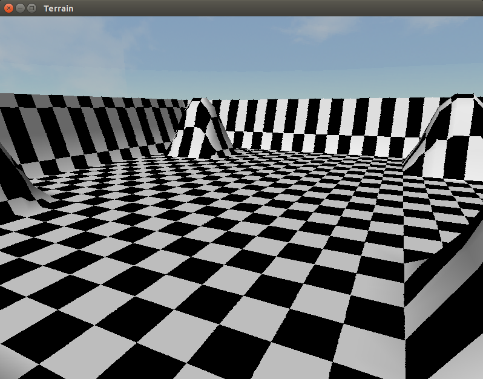
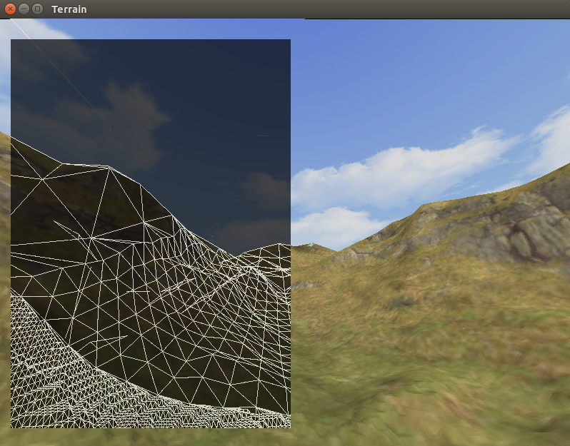
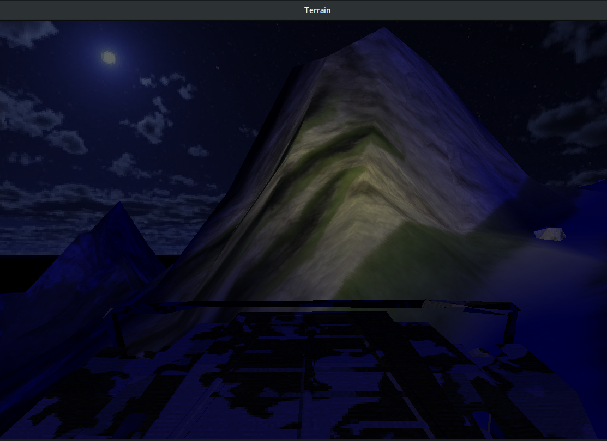

# Software renderer and game console

This repository contains implementation of software game engine. The main idea of this game engine was to study different algorithms (graphics, games, etc), using vurtual linear addressed video buffer. This means that all the manipulations with the graphics (math, transformation, rasterisation, etc.) you must perform manually. And only then you will send data to the video memory.

## Linear video buffer implementation

The idea of using abstract linear addressed video buffer was taken from book of Andre LaMothe. And implementation on this buffer under the linux was the problem that I faced.

In my implementation the linear video buffer is an abstraction consisting of an array in the system memory with a step of 4 bytes to store the pixel color in the format `ARGB (byte-ordered)`. Usually buffer has size is evaluated as *window_width x widnow_height x bytes_per_pixel*.

The linear buffer has the following interface:
- `operator[]` - allows you to access and write to the buffer data
- `Clear()` - Clears the buffer with the specified color
- `SendDataToFB()` - sends data to video memory (used at the end of rasterization)

`SendDataToFB()` implemented throught OpenGL function `glDrawPixels`, which is now deprecated. But this fact is shouldn't be a problem since this function is present anywhere in compatibility opengl profile (or in the versions <= than 3.0).

For systems which has only OpenGL ES implementations we have another way to substitute `glDrawPixels` in core opengl profile (see comments in the end of `/lib/draw/gl_buffer.cc`).

This buffer can be easily reduced to 16 bit or 8 bit color space manually.

## Game engine examples

Directory `examples` contains examples based on the game engine. Currently there are placed game called `Raiders 3D` which is my implementation of the game originally written by Andre LaMothe, draft of the game `Mountain race` and draft of the game like FPS.

<div style="text-align: center;" markdown="1" />

</div>
<div style="text-align: center;" markdown="1" />

</div>
<div style="text-align: center;" markdown="1" />

</div>
<div style="text-align: center;" markdown="1" />

</div>
<div style="text-align: center;" markdown="1" />

</div>
<div style="text-align: center;" markdown="1" />

</div>

## Libraries used in game console

`math` - mathematical library, which I start to implement just now

`window` - performs to create window, toggle fullscreen, grab keybord events and mouse events

`draw` - draw functions, which may be used with drawing surface, given by `window` library

`audio` - is a wrapper to BASS and BASS_FX audio libraries

`system` - useful system stuffs, such as timer

`data` - data manipulation classes

`physics` - very simple physics calulations

`extras` - addons to draw lib, such as terrains, nature, birds and other

## Install

### Check dependicies:

Following packages should be installed (example given under Ubuntu 17.10):

```bash
 $ sudo apt install mesa-common-dev
 $ sudo apt install mesa-utils
 $ sudo apt install libxrandr-dev
 $ sudo apt install libglu1-mesa-dev
```

### Install `libbass.so` audio libraries (for audio module):

```bash
  $ wget http://us.un4seen.com/files/bass24-linux.zip
  $ unzip bass24-linux.zip -d tmp/
  $ sudo cp tmp/x64/libbass.so /usr/local/lib/  # for 32-bit - tmp/libbass.so
  $ sudo chmod a+rx /usr/local/lib/libbass.so
  $ sudo ldconfig
  $ rm -rf tmp/ bass24-linux.zip
```

Install `libbass_fx.so` - is the same as above

P.S.: if something goes wrong while downloading bass audio library, then the best way is to use [direct link](https://www.un4seen.com/bass.html) for downloading library

### Finish the installation:

```bash
  $ git clone https://github.com/ans-hub/game_console
```

## Notes:

### Note about installation under cygwin:

This packages should be installed to work with video modes:

* cygutils-x11
* libGLU1
* xrandr
* randrproto
* libxcb-randr0

Also is necessary to add path to environment variable PATH:
```bash
  $ export PATH=/usr/local/lib:$PATH
```

Installation of bass audio library is similar, but in the case of cygwin we should download windows libraries (`bass.dll` and `bass_fx.dll`) and place it in `/usr/local/lib/`

### Note about disable FPS limiting to 60 fps

When start any example, use `vblank_mode=0 ./some_example`