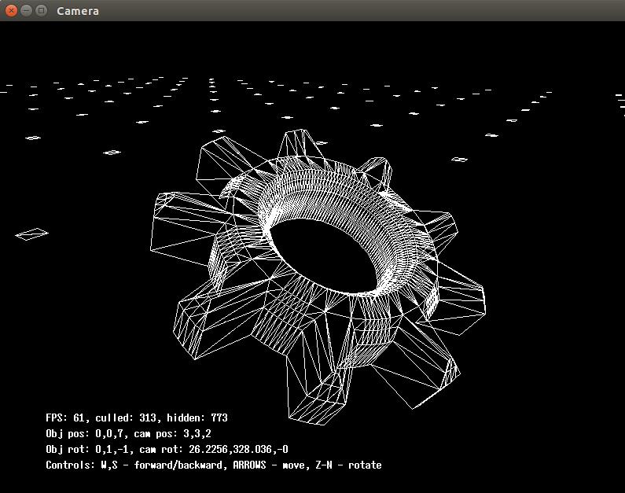

# Matrix transformation example

This example shown loading model from ply file and making simple transformation with it using matrixes. Cameras - uvn or based on Euler`s angles

## Usage:
```bash
  $ make
  $ ./matrix ../00_data/objects/cube_flat.ply
  $ ./matrix ../00_data/objects/wheel_flat.ply
```

<div style="text-align: center;" markdown="1" />

</div>
