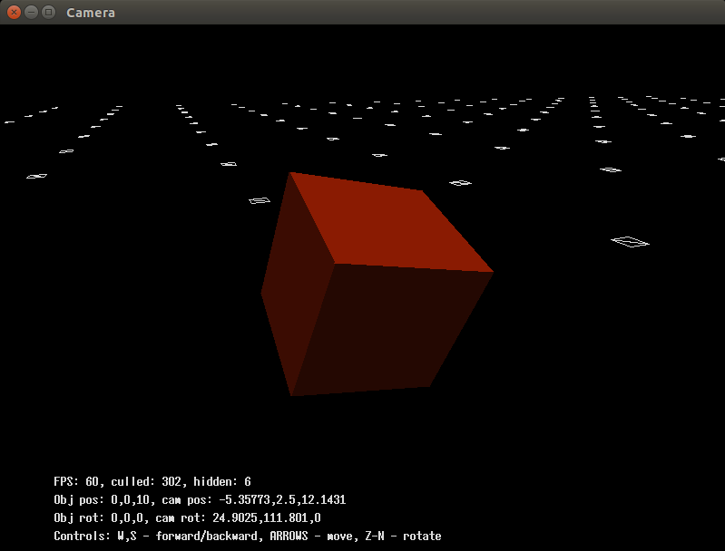
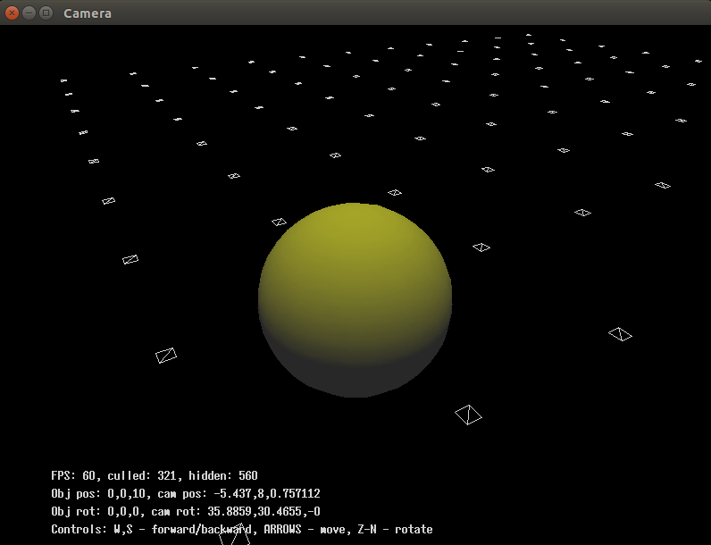

# Lighting example

Ambient, infinite and point lighting

## Usage:
```bash
  $ make
  $ ./lights_2 ../00_data/wheel_flat.ply
  $ ./lights_2 ../00_data/cube_flat.ply  
  $ ./lights_2 ../00_data/sphere_gouraud.ply
```

<div style="text-align: center;" markdown="1" />

</div>
<div style="text-align: center;" markdown="1" />

</div>
<div style="text-align: center;" markdown="1" />

</div>
<div style="text-align: center;" markdown="1" />

</div>
