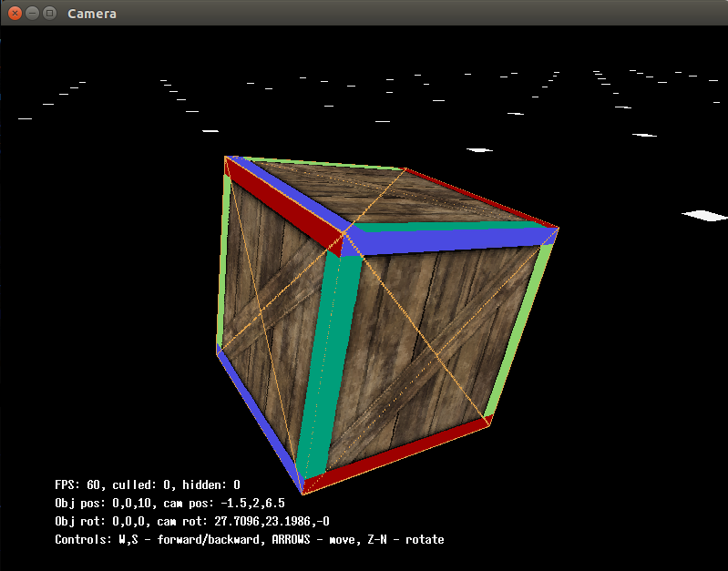
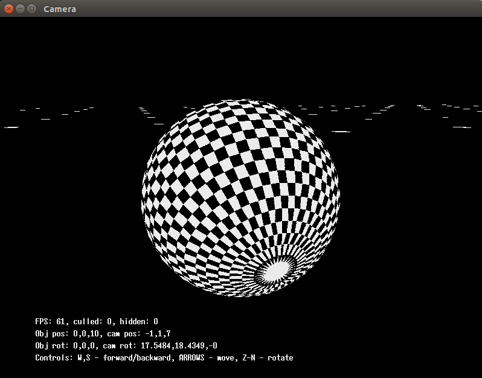
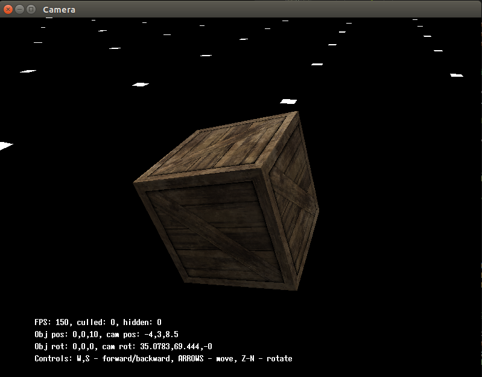

# 1/z buffer example

Here we use 1/z buffer and perspective correct texturing

## Usage:
```bash
  $ make
  $ ./inv_zbuf ../00_data/cube_texture.ply  
  $ ./inv_zbuf ../00_data/cube_texture_dbg.ply  
  $ ./inv_zbuf ../00_data/sphere_textured.ply
  $ ./inv_zbuf ../00_data/sphere_textured_2.ply
```

<div style="text-align: center;" markdown="1" />

</div>
<div style="text-align: center;" markdown="1" />

</div>
<div style="text-align: center;" markdown="1" />

</div>
<div style="text-align: center;" markdown="1" />

</div>