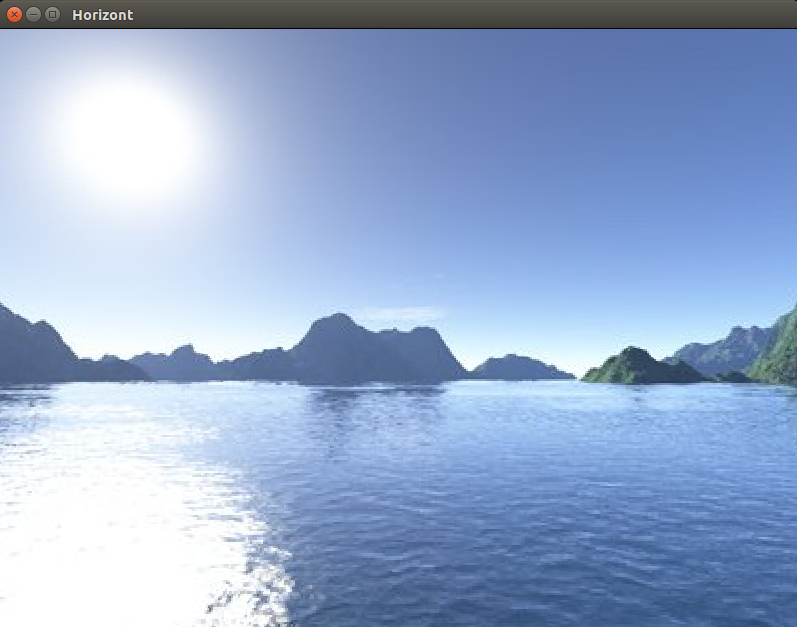

# Skybox using inverted cube

Example of inverted cube with texture imitates skybox

## Usage:
```bash
  $ make
  $ vblank_mode=0 ./skybox ../00_data/cube_skybox.ply
```

<div style="text-align: center;" markdown="1" />

</div>