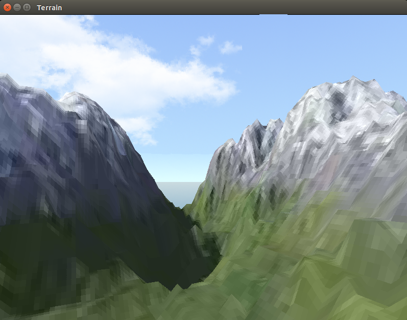
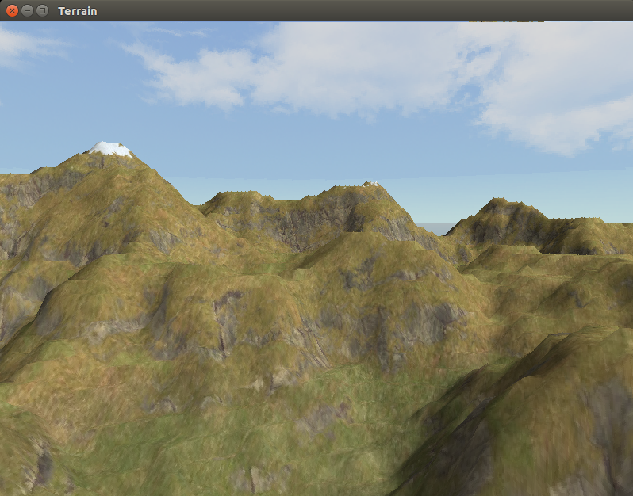
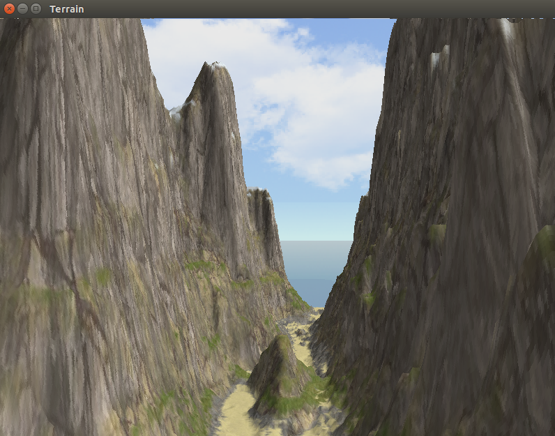

# Terrain and skybox

Example of different terrains generating with skyboxes.

## Usage:
```bash
  $ make
  $ ./terrains levels/01.lvl
  $ ./terrains levels/02.lvl
  $ ./terrains levels/07.lvl
  $ ./terrains levels/08.lvl
```
## Subdirectories:

<div style="text-align: center;" markdown="1" />

</div>
<div style="text-align: center;" markdown="1" />

</div>
<div style="text-align: center;" markdown="1" />

</div>
<div style="text-align: center;" markdown="1" />

</div>
