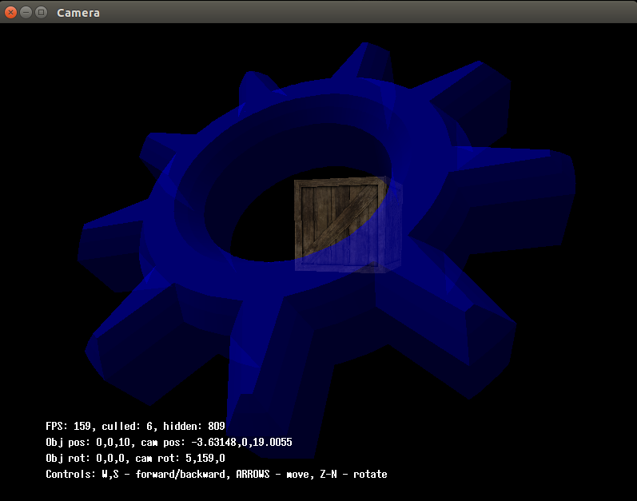
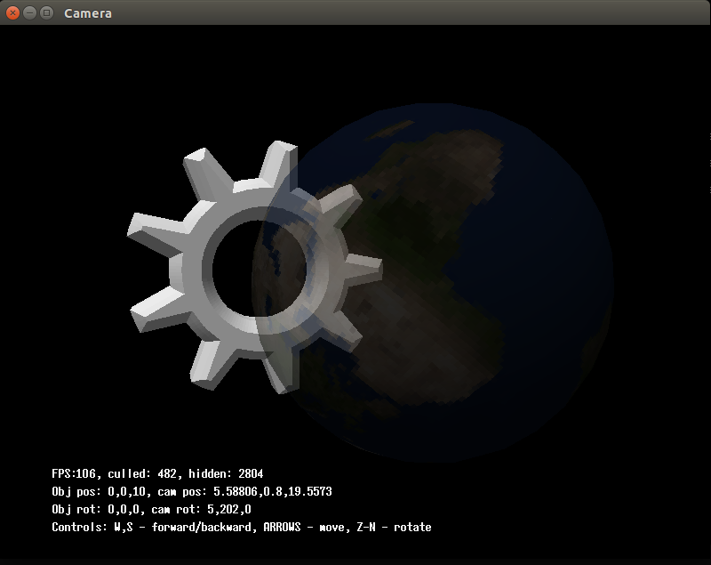

# Alpha blending example

Examples of alpha blending

## Usage:
```bash
  $ make
  $ ./alpha_blending ../00_data/objects/cube_flat.ply ../00_data/objects/cube_flat.ply
```

<div style="text-align: center;" markdown="1" />

</div>
<div style="text-align: center;" markdown="1" />

</div>
<div style="text-align: center;" markdown="1" />

</div>